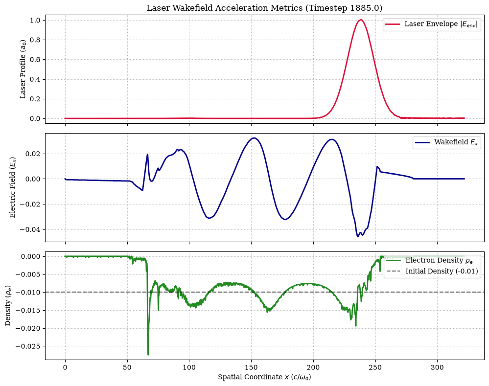

# Laser Wakefield Acceleration (LWFA) Simulation

This repository contains a high-fidelity 1D Particle-in-Cell (PIC) simulation configuration and analysis pipeline for **Laser Wakefield Acceleration (LWFA)** operating in the weakly non-linear regime. The setup leverages an advanced envelope solver to bypass fine optical cycles, allowing rapid tracking of plasma wave cavitation and massive accelerating gradients.

---

## 🔬 Project Overview

When an ultra-intense laser pulse propagates through underdense plasma, its **ponderomotive force** expels background electrons away from the pulse center. The heavier ions remain relatively immobile, establishing a strong, co-propagating electrostatic space-charge separation (the wakefield). Relativistic electrons can trap in this wake, achieving gigaelectronvolt (GeV) energy gains over centimeter scales.

This project configures a 1D plasma channel to observe:
* **Laser Envelope Propagation:** Tracking $a_0 = 1.0$ pulse evolution.
* **Electron Density Cavitation:** Monitoring compression ($\rho_e$) and vacuum bubble formation.
* **Longitudinal Accelerating Gradients:** Mapping the longitudinal electric field ($E_x$) profile behind the laser.

---

## Diagnostics



---

## 🛠 What is Smilei?

[Smilei](https://smileipic.github.io/Smilei/) is a collaborative, open-source **Particle-in-Cell (PIC)** simulation code optimized for high-performance computing (HPC) architectures. It features:
* Multi-species particle pushing via relativistic solvers (e.g., standard Boris or specialized ponderomotive pushers).
* Energy-conserving finite-difference time-domain (FDTD) Maxwell solvers.
* Advanced macroparticle tracking and automated dynamic load balancing via Hilbert curves.
* Comprehensive Python-driven configuration files (namelists) and post-processing tools (`happi`).

---

## 🚀 Getting Started & Execution

### Prerequisites
1. **Smilei Binary:** Ensure you have compiled the `smilei` binary (optimized for your CPU architecture or master branch `49367cf-master`).
2. **MPI Runtime:** Parallel execution requires an MPI installation (e.g., OpenMPI or MPICH).
3. **Python Stack:** Ensure `numpy`, `matplotlib`, and the `happi` package (included in the Smilei source distribution) are installed in your environment.

### 1. Running the Simulation
Execute the simulation via your parallel runtime. This splits the grid layout across 16 parallel moving patches using 4 MPI processes:

```bash
mpirun -np 4 /path/to/your/Smilei/smilei laser_wake.py
